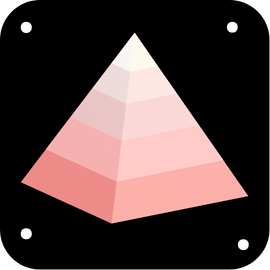

<div align="center">
  
  <h1>KAIRO</h1>
  <p><strong>Act at the right moment. Secure from the first line.</strong></p>
  <p>A Node.js framework where security is the substrate — not a checklist.</p>

  <p>
    <a href="https://www.npmjs.com/package/@thekairojs/kairo"></a>
    <a href="https://github.com/thekairojs/kairo.js/actions"></a>
    
    
    
  </p>
</div>

---

```
Request → Membrane → Trust Lattice → Your Code → Data Shield → Sentinel → Response
```

Most frameworks give you a router and leave security to you. You reach for helmet, rate-limit, zod, cors — each one a separate package, separate config, separate failure surface. It works until it doesn't.

KAIRO builds security into the request lifecycle itself. Entropy scoring, taint tracking, claim-based auth, PII scanning, and canary leak detection run as first-class layers — not middleware you remember to add.

---

## Packages

| Package | Version | Description |
|---------|---------|-------------|
| [`@thekairojs/kairo`](https://www.npmjs.com/package/@thekairojs/kairo) | [](https://www.npmjs.com/package/@thekairojs/kairo) | Core — app, router, context, middleware |
| [`@thekairojs/kairo-membrane`](https://www.npmjs.com/package/@thekairojs/kairo-membrane) | [](https://www.npmjs.com/package/@thekairojs/kairo-membrane) | Entropy scoring, taint tracking, HMAC signing |
| [`@thekairojs/kairo-lattice`](https://www.npmjs.com/package/@thekairojs/kairo-lattice) | [](https://www.npmjs.com/package/@thekairojs/kairo-lattice) | Claim-based auth with ordered trust levels |
| [`@thekairojs/kairo-hardening`](https://www.npmjs.com/package/@thekairojs/kairo-hardening) | [](https://www.npmjs.com/package/@thekairojs/kairo-hardening) | Block high-entropy requests automatically |
| [`@thekairojs/kairo-shield`](https://www.npmjs.com/package/@thekairojs/kairo-shield) | [](https://www.npmjs.com/package/@thekairojs/kairo-shield) | Outbound PII detection and redaction |
| [`@thekairojs/kairo-sentinel`](https://www.npmjs.com/package/@thekairojs/kairo-sentinel) | [](https://www.npmjs.com/package/@thekairojs/kairo-sentinel) | Runtime anomaly detection, canary records |
| [`@thekairojs/kairo-dx`](https://www.npmjs.com/package/@thekairojs/kairo-dx) | [](https://www.npmjs.com/package/@thekairojs/kairo-dx) | Schema validation middleware + dev logger |
| [`@thekairojs/kairo-cli`](https://www.npmjs.com/package/@thekairojs/kairo-cli) | [](https://www.npmjs.com/package/@thekairojs/kairo-cli) | Scaffold, route inspection, security audit |

### Database & Server Adapters

| Package | Version | Description |
|---------|---------|-------------|
| [`@thekairojs/kairo-adapter-prisma`](https://www.npmjs.com/package/@thekairojs/kairo-adapter-prisma) | [](https://www.npmjs.com/package/@thekairojs/kairo-adapter-prisma) | Prisma — entropy gating, canary injection, result scanning |
| [`@thekairojs/kairo-adapter-drizzle`](https://www.npmjs.com/package/@thekairojs/kairo-adapter-drizzle) | [](https://www.npmjs.com/package/@thekairojs/kairo-adapter-drizzle) | Drizzle ORM — entropy gating, canary injection, result scanning |
| [`@thekairojs/kairo-adapter-pg`](https://www.npmjs.com/package/@thekairojs/kairo-adapter-pg) | [](https://www.npmjs.com/package/@thekairojs/kairo-adapter-pg) | node-postgres — entropy gating, canary injection, result scanning |
| [`@thekairojs/kairo-adapter-uws`](https://www.npmjs.com/package/@thekairojs/kairo-adapter-uws) | [](https://www.npmjs.com/package/@thekairojs/kairo-adapter-uws) | uWebSockets.js drop-in server adapter |

---

## Quick start

```bash
npm install @thekairojs/kairo @thekairojs/kairo-membrane @thekairojs/kairo-lattice @thekairojs/kairo-hardening
```

```ts
import { createApp } from '@thekairojs/kairo'
import { createMembrane } from '@thekairojs/kairo-membrane'
import { createLattice } from '@thekairojs/kairo-lattice'
import { createHardening } from '@thekairojs/kairo-hardening'

const app = createApp()

const lattice = createLattice({
  resolve: async (ctx) => ({
    level:   ctx.headers['x-trust'] ?? 'none',
    roles:   [],
    subject: ctx.headers['x-user-id'],
  }),
})

app.use(createMembrane())
app.use(createHardening({ threshold: 0.75 }))
app.use(lattice)

app.get('/public', (ctx) => {
  ctx.json({ ok: true })
})

app.get('/admin', lattice.require({ level: 'high' }), (ctx) => {
  ctx.json({ ok: true })
})

await app.listen(3000)
```

---

## How it works

Every request gets an **entropy score** from `0.0` (clean) to `1.0` (hostile), built from four signals:

| Signal | Weight | What it catches |
|--------|--------|----------------|
| Header anomalies | 30% | Scanner user-agents, injection characters, missing fields |
| IP behavior | 35% | Request rate, path enumeration, ghost route hits |
| Payload | 20% | Body size spikes, suspicious content types |
| Timing | 15% | Inter-request cadence vs. rolling baseline |

That score lives at `ctx.kairo.entropy` and flows through every layer. The hardening middleware blocks anything at or above your threshold before it reaches your handlers — silently, without leaking why.

---

## Architecture

Seven layers. Each one independent, each one composable.

| Layer | Package | Role |
|-------|---------|------|
| Request Membrane | `kairo-membrane` | Score and taint-track every request |
| Intent Engine | `kairo-intent` | Classify request patterns |
| Trust Lattice | `kairo-lattice` | `none < low < medium < high` — per-route enforcement |
| Your Code | — | Handlers run here, after all guards pass |
| Data Shield | `kairo-shield` | Scan outbound responses for PII before they leave |
| Runtime Sentinel | `kairo-sentinel` | Anomaly detection, canary leak detection |
| DX / Hardening | `kairo-dx`, `kairo-hardening` | Validation middleware, dev diagnostics, active blocking |

---

## Ghost routes

Decoy endpoints that silently flag any IP that probes them. Real users never hit these paths.

```ts
app.ghost('/.env')
app.ghost('/wp-login.php')
app.ghost('/admin/backdoor', { alertLevel: 'high' })
```

A ghost hit elevates that IP's entropy score for all subsequent requests and emits a `ghost_route_hit` security event.

---

## Canary records

Inject invisible tokens into database rows. If one surfaces in an API response, you know exactly what leaked and from where.

```ts
import { createCanary, scanForCanary } from '@thekairojs/kairo-sentinel'

// Stamp a row before writing to the database
const row = createCanary({ id: userId, email: user.email }, ctx)
await db.insert(usersTable).values(row)

// The adapter can scan results automatically
const kp = createPrismaAdapter(prisma, { canaryModels: ['user'], scanResults: true })
```

---

## CLI

```bash
npx @thekairojs/kairo-cli new my-app    # scaffold a new project
npx @thekairojs/kairo-cli routes        # list all registered routes
npx @thekairojs/kairo-cli audit         # scan for security anti-patterns
```

---

## Documentation

Full walkthrough of every layer with code examples → [userguide.md](./userguide.md)

---

## License

MIT — [github.com/thekairojs/kairo.js](https://github.com/thekairojs/kairo.js)
